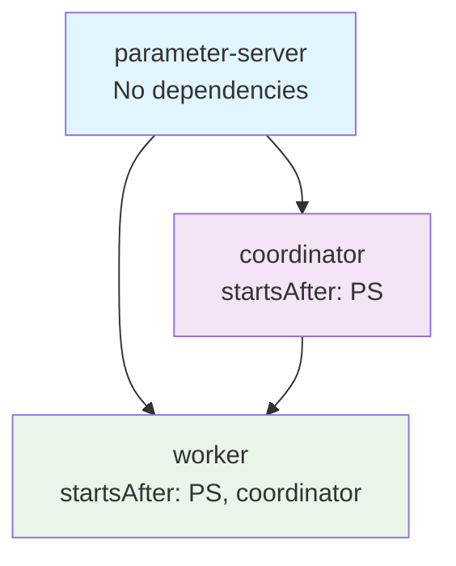
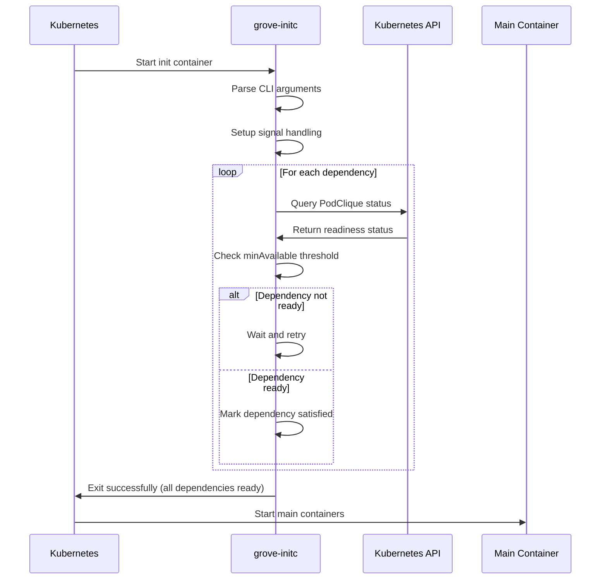
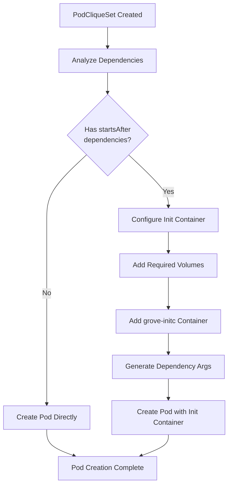
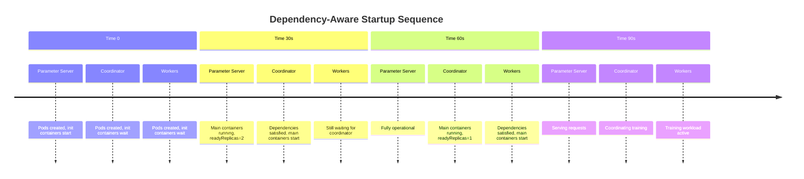

# Dependency Management and Init Containers

This document covers Grove's dependency management system, which ensures that PodCliques start up in the correct order based on their interdependencies. Grove uses init containers (`grove-initc`) to implement declarative dependency waiting, where pods block until their dependent PodCliques are ready.

## Overview

Grove's dependency management solves the critical problem of coordinated startup in distributed AI workloads where certain components must be fully operational before others can begin. Rather than requiring manual coordination or complex startup scripts, Grove uses Kubernetes init containers to declaratively wait for dependencies.

### The Challenge

Distributed AI workloads often have complex startup sequences:

- **Parameter servers** must be ready before workers can connect
- **Coordinators** must initialize before distributed training begins  
- **Storage services** must be available before compute workloads start
- **Service discovery** must be functional before inter-pod communication

### Grove's Solution

Grove provides declarative dependency management through:

1. **Startup Dependencies**: `startsAfter` field in PodClique specs
2. **Init Container System**: `grove-initc` binary for dependency waiting
3. **Automatic Injection**: Grove Operator automatically configures init containers
4. **API-based Monitoring**: Real-time dependency status checking

## Startup Dependencies

PodCliques declare startup dependencies using the `startsAfter` field, which references other PodCliques by their `roleName`.

### Dependency Declaration

```yaml
# Parameter Server - no dependencies, starts first
apiVersion: grove.io/v1alpha1
kind: PodClique
metadata:
  name: parameter-server
spec:
  roleName: parameter-server
  replicas: 2
  minAvailable: 1
  # No startsAfter - starts immediately

---
# Coordinator - waits for parameter server  
apiVersion: grove.io/v1alpha1
kind: PodClique
metadata:
  name: coordinator
spec:
  roleName: coordinator
  replicas: 1
  minAvailable: 1
  startsAfter: ["parameter-server"]  # Wait for PS to be ready

---
# Workers - wait for both PS and coordinator
apiVersion: grove.io/v1alpha1
kind: PodClique
metadata:
  name: workers
spec:
  roleName: worker
  replicas: 8
  minAvailable: 6
  startsAfter: ["parameter-server", "coordinator"]  # Wait for both
```

### Dependency Graph Validation

Grove validates dependency graphs to ensure they are:

1. **Acyclic**: No circular dependencies  
2. **Resolvable**: All referenced PodCliques exist
3. **Well-formed**: Dependencies form a valid DAG (Directed Acyclic Graph)



**Valid Dependency Patterns:**
- Linear: A → B → C
- Fan-out: A → B, A → C  
- Diamond: A → B, A → C, B → D, C → D

**Invalid Patterns:**
- Cycles: A → B → C → A
- Missing references: A → "nonexistent-clique"

## Init Container Implementation

The `grove-initc` binary serves as the init container that implements dependency waiting logic. It runs before the main application containers and blocks until all specified dependencies are satisfied.

### Init Container Architecture



### Entry Point Logic

The init container follows this execution flow:

```go
func main() {
    // 1. Setup signal handling for graceful shutdown
    ctx, cancel := signal.NotifyContext(context.Background(), 
        syscall.SIGTERM, syscall.SIGINT)
    defer cancel()
    
    // 2. Parse dependency specifications from CLI arguments
    dependencies := parsePodCliqueArgs(os.Args)
    
    // 3. Create PodClique state tracker
    state := NewPodCliqueState(dependencies)
    
    // 4. Wait for all dependencies to be ready
    err := state.WaitForReady(ctx)
    if err != nil {
        log.Fatalf("Dependency wait failed: %v", err)
    }
    
    // 5. Exit successfully (allows main containers to start)
    log.Info("All dependencies ready, starting main containers")
}
```

### Command Line Arguments

The init container receives dependency specifications as CLI arguments:

```bash
grove-initc \
  --podcliques=parameter-server:1 \
  --podcliques=coordinator:1
```

**Argument Format:**
```
--podcliques=<fully-qualified-name>:<min-available-count>
```

Where:
- `fully-qualified-name`: PodClique role name within the PodCliqueSet
- `min-available-count`: Minimum ready replicas required for dependency to be satisfied

### Dependency Status Checking

The init container monitors dependency status by:

1. **Querying PodClique Resources**: Uses Kubernetes API to check PodClique status
2. **Evaluating Readiness**: Compares `readyReplicas` against required `minAvailable`
3. **Polling with Backoff**: Retries with exponential backoff on failures
4. **Graceful Shutdown**: Handles termination signals cleanly

```yaml
# Example PodClique status evaluation
status:
  replicas: 3
  readyReplicas: 2      # Current ready count
  # Dependency satisfied if readyReplicas >= minAvailable (1)
```

## Operator Integration

The Grove Operator automatically configures init containers for pods that have startup dependencies.

### Init Container Injection Process



### Volume Configuration

The operator configures essential volumes for the init container:

#### 1. ServiceAccount Token Volume

Provides Kubernetes API authentication:

```yaml
volumes:
- name: sa-token-secret-vol
  secret:
    secretName: grove-initc-sa-token
    defaultMode: 0420  # Read-only permissions
```

**Mount Path:** `/var/run/secrets/kubernetes.io/serviceaccount`

#### 2. Pod Information Volume (DownwardAPI)

Provides pod metadata for API queries:

```yaml
volumes:
- name: pod-info-vol
  downwardAPI:
    items:
    - path: namespace
      fieldRef:
        fieldPath: metadata.namespace
    - path: podgangname
      fieldRef:
        fieldPath: metadata.labels['grove.io/podgang']
```

**Mount Path:** `/var/grove/pod-info`
**Contents:**
- `namespace`: Kubernetes namespace where pod runs
- `podgangname`: Name of the PodGang this pod belongs to

### Init Container Specification

The operator generates the complete init container spec:

```yaml
initContainers:
- name: grove-initc
  image: grove/grove-initc:v1.0.0
  args:
  - --podcliques=parameter-server:1
  - --podcliques=coordinator:1
  
  volumeMounts:
  - name: sa-token-secret-vol
    mountPath: /var/run/secrets/kubernetes.io/serviceaccount
    readOnly: true
  - name: pod-info-vol
    mountPath: /var/grove/pod-info
    readOnly: true
  
  resources:
    requests:
      cpu: "100m"
      memory: "128Mi"
    limits:
      cpu: "200m"
      memory: "256Mi"
  
  securityContext:
    allowPrivilegeEscalation: false
    runAsNonRoot: true
    readOnlyRootFilesystem: true
    capabilities:
      drop: ["ALL"]
```

### Argument Generation Logic

The operator generates init container arguments based on PodClique dependencies:

```go
func generateArgsForInitContainer(clique *PodClique, template *PodCliqueSetTemplate) []string {
    var args []string
    
    for _, depName := range clique.Spec.StartsAfter {
        // Find dependency in template
        depClique := findCliqueByName(template.Cliques, depName)
        if depClique == nil {
            return nil, fmt.Errorf("dependency %s not found", depName)
        }
        
        // Generate argument: --podcliques=<name>:<minAvailable>
        minAvailable := depClique.Spec.MinAvailable
        if minAvailable == nil {
            minAvailable = &depClique.Spec.Replicas
        }
        
        arg := fmt.Sprintf("--podcliques=%s:%d", depName, *minAvailable)
        args = append(args, arg)
    }
    
    return args
}
```

## Container Image Configuration

The init container image is configured through environment variables:

```bash
# Operator configuration
GROVE_INIT_CONTAINER_IMAGE=grove/grove-initc  # Registry + repository
```

The operator automatically appends the Grove version as the image tag:

```go
image := fmt.Sprintf("%s:%s", initContainerImage, version.Get().GitVersion)
// Results in: grove/grove-initc:v1.0.0
```

## Dependency Runtime Behavior

### Startup Sequence



### Dependency Resolution Example

Consider a distributed training setup with complex dependencies:

```yaml
# Storage layer - no dependencies
- name: storage
  spec:
    replicas: 1
    minAvailable: 1
    # No startsAfter

# Parameter servers - need storage
- name: parameter-server
  spec:
    replicas: 2
    minAvailable: 1
    startsAfter: ["storage"]

# Coordinator - needs parameter servers
- name: coordinator
  spec:
    replicas: 1
    minAvailable: 1
    startsAfter: ["parameter-server"]

# Workers - need both parameter servers and coordinator
- name: worker
  spec:
    replicas: 8
    minAvailable: 6
    startsAfter: ["parameter-server", "coordinator"]
```

**Resolution Order:**
1. **storage** pods start immediately (no dependencies)
2. **parameter-server** pods wait for storage.readyReplicas ≥ 1
3. **coordinator** pods wait for parameter-server.readyReplicas ≥ 1  
4. **worker** pods wait for both parameter-server.readyReplicas ≥ 1 AND coordinator.readyReplicas ≥ 1

## Error Handling and Recovery

### Signal Handling

The init container implements graceful shutdown:

```go
func main() {
    ctx, cancel := signal.NotifyContext(context.Background(), 
        syscall.SIGTERM, syscall.SIGINT)
    defer cancel()
    
    // First signal: graceful shutdown
    // Second signal: immediate exit
    go func() {
        <-ctx.Done()
        log.Info("Received termination signal, shutting down gracefully")
        
        // Wait for second signal
        secondSignal := make(chan os.Signal, 1)
        signal.Notify(secondSignal, syscall.SIGTERM, syscall.SIGINT)
        <-secondSignal
        log.Error("Received second signal, forcing exit")
        os.Exit(1)
    }()
    
    // Main dependency waiting logic...
}
```

### Retry and Backoff

Dependency checking uses exponential backoff:

```go
func (s *PodCliqueState) waitForDependency(ctx context.Context, dep Dependency) error {
    backoff := wait.Backoff{
        Duration: 1 * time.Second,
        Factor:   2.0,
        Jitter:   0.1,
        Steps:    10,  // Maximum 10 retries
        Cap:      60 * time.Second,  // Maximum 60s between retries
    }
    
    return wait.ExponentialBackoffWithContext(ctx, backoff, func() (bool, error) {
        ready, err := s.checkDependencyReady(dep)
        if err != nil {
            log.Warnf("Error checking dependency %s: %v", dep.Name, err)
            return false, nil  // Retry on errors
        }
        
        return ready, nil
    })
}
```

### Common Failure Scenarios

#### Dependency Never Becomes Ready

**Symptoms:**
- Init container logs show continuous waiting
- Main containers never start
- Pod stuck in `Init:0/1` status

**Diagnosis:**
```bash
# Check init container logs
kubectl logs <pod-name> -c grove-initc

# Check dependency PodClique status
kubectl describe podclique <dependency-name>

# Check dependency pod status
kubectl get pods -l grove.io/role=<dependency-role>
```

**Solutions:**
- Fix issues with dependency PodClique
- Adjust `minAvailable` requirements
- Check resource constraints preventing dependency scheduling

#### API Permission Issues

**Symptoms:**
- Init container logs show API authentication errors
- `403 Forbidden` or `401 Unauthorized` messages

**Diagnosis:**
```bash
# Check ServiceAccount permissions
kubectl auth can-i get podcliques --as=system:serviceaccount:<namespace>:<sa-name>

# Check ServiceAccount token
kubectl describe secret <sa-token-secret-name>
```

**Solutions:**
- Verify RBAC configuration
- Check ServiceAccount token secret creation
- Ensure proper volume mounts

#### Circular Dependencies

**Symptoms:**
- Operator fails to create PodCliques
- Validation errors about circular references

**Diagnosis:**
```bash
# Check PodCliqueSet events
kubectl describe podcliqueset <name>

# Review dependency graph in spec
kubectl get podcliqueset <name> -o yaml | grep -A 20 startsAfter
```

**Solutions:**
- Redesign dependency graph to be acyclic
- Remove unnecessary dependencies
- Consider using different startup coordination mechanisms

## Complete Example

Here's a comprehensive example showing dependency management in a distributed training workload:

```yaml
apiVersion: grove.io/v1alpha1
kind: PodCliqueSet
metadata:
  name: ml-training
spec:
  replicas: 2
  
  template:
    cliqueStartupType: CliqueStartupTypeExplicit  # Use explicit dependencies
    
    cliques:
    # Storage service - starts first
    - name: storage
      spec:
        roleName: storage
        replicas: 1
        minAvailable: 1
        podSpec:
          containers:
          - name: storage
            image: minio/minio:latest
            resources:
              requests:
                cpu: "500m"
                memory: "1Gi"
    
    # Parameter servers - wait for storage
    - name: parameter-server
      spec:
        roleName: parameter-server
        replicas: 3
        minAvailable: 2  # Need at least 2/3 parameter servers
        startsAfter: ["storage"]
        podSpec:
          containers:
          - name: ps
            image: tensorflow/tensorflow:2.8.0
            resources:
              requests:
                cpu: "2"
                memory: "4Gi"
    
    # Training coordinator - wait for parameter servers
    - name: coordinator
      spec:
        roleName: coordinator
        replicas: 1
        minAvailable: 1
        startsAfter: ["parameter-server"]
        podSpec:
          containers:
          - name: coordinator
            image: training/coordinator:v1.0
            env:
            - name: PS_HOSTS
              value: "parameter-server-0:2222,parameter-server-1:2222,parameter-server-2:2222"
    
    # Workers - wait for both parameter servers and coordinator
    - name: worker
      spec:
        roleName: worker
        replicas: 8
        minAvailable: 6  # Can start training with 6/8 workers
        startsAfter: ["parameter-server", "coordinator"]
        podSpec:
          containers:
          - name: worker
            image: training/worker:v1.0
            env:
            - name: PS_HOSTS
              value: "parameter-server-0:2222,parameter-server-1:2222,parameter-server-2:2222"
            - name: COORDINATOR_HOST
              value: "coordinator-0:8080"
            resources:
              requests:
                nvidia.com/gpu: "1"
                cpu: "4"
                memory: "8Gi"
```

### Generated Init Containers

For the worker PodClique, the operator generates pods with init containers:

```yaml
apiVersion: v1
kind: Pod
metadata:
  name: ml-training-worker-0-0
spec:
  initContainers:
  - name: grove-initc
    image: grove/grove-initc:v1.0.0
    args:
    - --podcliques=parameter-server:2  # Wait for 2 ready PS pods
    - --podcliques=coordinator:1       # Wait for 1 ready coordinator
    
    volumeMounts:
    - name: sa-token-secret-vol
      mountPath: /var/run/secrets/kubernetes.io/serviceaccount
    - name: pod-info-vol
      mountPath: /var/grove/pod-info
  
  containers:
  - name: worker
    # Main container spec...
  
  volumes:
  - name: sa-token-secret-vol
    secret:
      secretName: ml-training-worker-sa-token
  - name: pod-info-vol
    downwardAPI:
      items:
      - path: namespace
        fieldRef:
          fieldPath: metadata.namespace
      - path: podgangname  
        fieldRef:
          fieldPath: metadata.labels['grove.io/podgang']
```

## Best Practices

### Dependency Design

1. **Minimize Dependencies**: Only declare essential startup dependencies
2. **Use Appropriate MinAvailable**: Set values that allow for reasonable startup times
3. **Avoid Deep Chains**: Keep dependency chains short and simple
4. **Plan for Failures**: Design dependencies to handle component failures gracefully

### Resource Planning

1. **Init Container Resources**: Set appropriate CPU/memory limits for init containers
2. **Startup Time Budgets**: Plan for additional startup time due to dependency waiting
3. **Cluster Capacity**: Ensure sufficient resources for dependency pods to start first
4. **Storage Dependencies**: Consider persistent storage startup times

### Operational Guidelines

1. **Monitoring**: Monitor init container logs and dependency resolution times
2. **Testing**: Test dependency behavior under various failure conditions
3. **Documentation**: Document dependency relationships and startup requirements
4. **Health Checks**: Ensure dependency readiness probes are reliable and fast

### Troubleshooting Guidelines

1. **Log Analysis**: Always check init container logs for dependency issues
2. **Status Verification**: Verify dependency PodClique status and readiness
3. **Permission Checking**: Ensure init containers have proper API permissions
4. **Timeline Analysis**: Understand expected vs actual startup timelines

## Advanced Patterns

### Conditional Dependencies

Use different dependency patterns based on deployment mode:

```yaml
# Development mode - simplified dependencies
cliques:
- name: all-in-one
  spec:
    replicas: 1
    # No dependencies - single pod with all services

# Production mode - full dependency chain  
cliques:
- name: storage
- name: parameter-server
  spec:
    startsAfter: ["storage"]
- name: worker
  spec:
    startsAfter: ["parameter-server"]
```

### Health Check Integration

Coordinate with application health checks:

```yaml
spec:
  podSpec:
    containers:
    - name: app
      readinessProbe:
        httpGet:
          path: /ready
          port: 8080
        initialDelaySeconds: 10
        periodSeconds: 5
      # Init container waits for dependent readiness probes
```

### External Service Dependencies

Wait for external services using custom health checks:

```yaml
# Custom init container for external dependencies
initContainers:
- name: wait-for-database
  image: busybox
  command: 
  - sh
  - -c
  - "until nc -z database.external:5432; do sleep 1; done"
  
- name: grove-initc  # Grove dependency management
  # Standard Grove init container...
```
