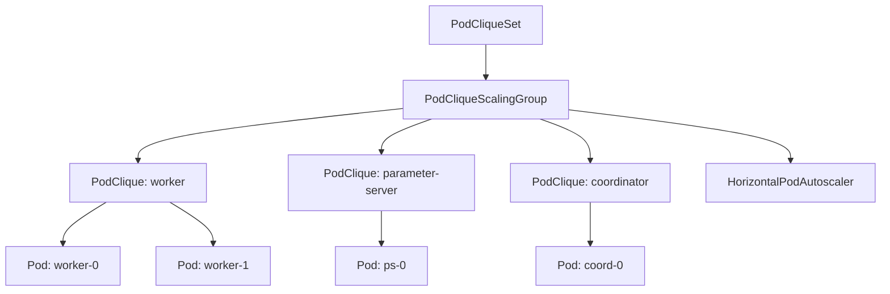
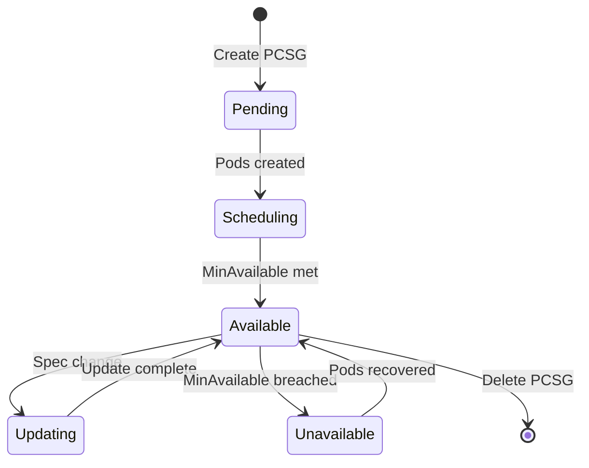
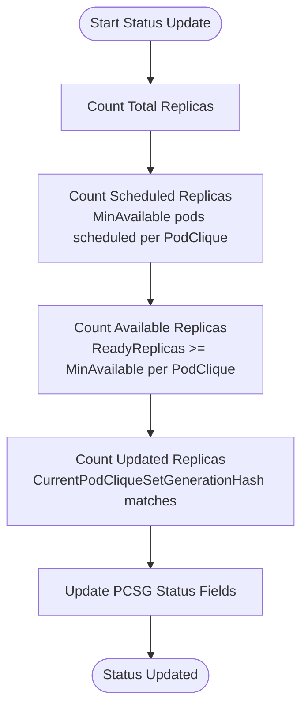
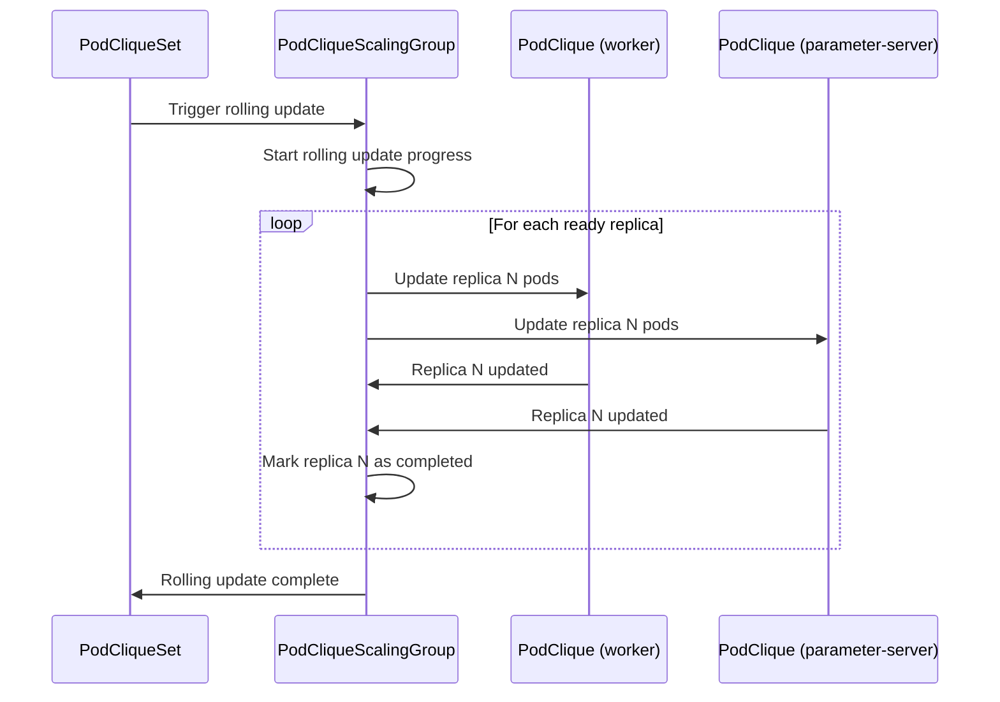
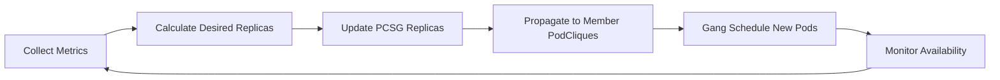

# PodCliqueScalingGroup

PodCliqueScalingGroup is a Grove custom resource that enables coordinated scaling of multiple PodCliques as a single logical unit. It provides a mechanism to scale groups of PodCliques together while maintaining minimum availability requirements and supporting both manual and automatic scaling operations.

## Overview

PodCliqueScalingGroup operates as an intermediate coordination layer between PodCliqueSet and individual PodClique resources. It enables proportional scaling where multiple PodCliques scale together as a cohesive unit, maintaining proper ratios and dependencies between related components.

### Key Use Cases

- **Leader-Worker Patterns**: Scale workers and parameter servers proportionally
- **Multi-Tier Applications**: Coordinate scaling across application tiers
- **Resource Optimization**: Ensure related components scale together for efficiency
- **Availability Management**: Maintain minimum availability across component groups

### Resource Relationships



## Resource Specification

A PodCliqueScalingGroup specification defines scaling group membership, replica count, and availability requirements:

```yaml
apiVersion: grove.io/v1alpha1
kind: PodCliqueScalingGroup
metadata:
  name: training-workers
spec:
  replicas: int32          # Desired number of replicas for the scaling group
  minAvailable: *int32     # Minimum required ready replicas  
  cliqueNames: []string    # Names of PodCliques in this scaling group
```

### Core Fields

| Field | Type | Required | Default | Description |
|-------|------|----------|---------|-------------|
| `replicas` | `int32` | No | 1 | Desired number of replicas for the scaling group |
| `minAvailable` | `*int32` | No | 1 | Minimum required ready replicas for operational status |
| `cliqueNames` | `[]string` | Yes | - | Names of PodCliques that are part of this scaling group |

### Configuration via PodCliqueSet

PodCliqueScalingGroups are typically defined within a PodCliqueSet template:

```yaml
apiVersion: grove.io/v1alpha1
kind: PodCliqueSet
spec:
  replicas: 2  # Creates 2 instances of the scaling group
  template:
    podCliqueScalingGroups:
    - name: "training-workers"
      cliqueNames: ["worker", "parameter-server"]
      replicas: 3          # Base multiplier for member PodCliques
      minAvailable: 2      # Need at least 2 replicas operational
      scaleConfig:         # HPA configuration
        minReplicas: 1
        maxReplicas: 10
        metrics:
        - type: Resource
          resource:
            name: cpu
            target:
              type: Utilization
              averageUtilization: 80
```

## Scaling Behavior

PodCliqueScalingGroup implements coordinated scaling where all member PodCliques scale proportionally based on the scaling group's replica count.

### Scaling Calculation

The effective replica count for each member PodClique is calculated as:

```
PodClique.replicas = PodCliqueScalingGroup.replicas × PodCliqueTemplateSpec.replicas
```

### Example Scaling Scenario

```yaml
# PodCliqueSet configuration
spec:
  replicas: 2  # 2 complete environments
  template:
    cliques:
    - name: worker
      spec:
        replicas: 4      # Base replica count
    - name: parameter-server  
      spec:
        replicas: 2      # Base replica count
    
    podCliqueScalingGroups:
    - name: training-group
      cliqueNames: ["worker", "parameter-server"]
      replicas: 3        # Scaling multiplier
```

**Resulting Replica Counts:**
- `worker` PodCliques: 4 × 3 = 12 replicas each (24 total across 2 environments)
- `parameter-server` PodCliques: 2 × 3 = 6 replicas each (12 total across 2 environments)

### Scaling States



## Status Reporting

PodCliqueScalingGroup provides comprehensive status reporting for monitoring scaling group health and progress.

### Status Fields

```yaml
status:
  replicas: 3                    # Observed number of replicas
  scheduledReplicas: 3           # Replicas with minimum pods scheduled
  availableReplicas: 2           # Replicas meeting availability requirements  
  updatedReplicas: 1             # Replicas at latest PodCliqueSet generation
  conditions: []metav1.Condition # Standard condition reporting
  rollingUpdateProgress:         # Rolling update state (if active)
    updateStartedAt: "2023-09-21T10:00:00Z"
    podCliqueSetGenerationHash: "abc123"
    updatedPodCliques: ["worker"]
    readyReplicaIndicesSelectedToUpdate:
      current: 1
      completed: [0]
```

### Status Calculation Logic



### Key Status Metrics

| Metric | Calculation | Purpose |
|--------|-------------|---------|
| `replicas` | Total number of PodCliqueScalingGroup replicas | Overall scale |
| `scheduledReplicas` | Replicas where member PodCliques have ≥ `minAvailable` pods scheduled | Scheduling progress |
| `availableReplicas` | Replicas where member PodCliques have ≥ `minAvailable` ready pods | Operational readiness |
| `updatedReplicas` | Replicas at current PodCliqueSet generation | Update progress |

## Rolling Updates

PodCliqueScalingGroup supports controlled rolling updates that coordinate updates across member PodCliques while maintaining availability.

### Rolling Update Process



### Progress Tracking

The `PodCliqueScalingGroupRollingUpdateProgress` structure tracks update state:

```yaml
rollingUpdateProgress:
  updateStartedAt: "2023-09-21T10:00:00Z"          # Update start time
  updateEndedAt: "2023-09-21T10:05:30Z"            # Update completion (optional)
  podCliqueSetGenerationHash: "def456"             # Target generation
  updatedPodCliques: ["worker", "parameter-server"] # Completed member updates
  readyReplicaIndicesSelectedToUpdate:             # Replica update progress
    current: 2                                     # Currently updating replica
    completed: [0, 1]                             # Completed replica indices
```

### Update Coordination

1. **Replica Selection**: Select one ready replica for update at a time
2. **Member Updates**: Update all member PodCliques for selected replica  
3. **Availability Checking**: Ensure `minAvailable` requirements are met
4. **Progress Tracking**: Record completion and move to next replica
5. **Completion**: Mark update as finished when all replicas updated

## Autoscaling Integration

PodCliqueScalingGroup can be configured with HorizontalPodAutoscaler integration for automatic scaling based on metrics.

### Autoscaling Configuration

```yaml
# In PodCliqueSet template
podCliqueScalingGroups:
- name: training-infrastructure
  cliqueNames: ["worker", "parameter-server"]
  replicas: 2
  minAvailable: 1
  scaleConfig:                    # Creates HPA for the scaling group
    minReplicas: 1
    maxReplicas: 10
    metrics:
    - type: Resource
      resource:
        name: cpu
        target:
          type: Utilization
          averageUtilization: 75
    - type: Pods
      pods:
        metric:
          name: training_throughput
        target:
          type: AverageValue
          averageValue: "1000"
```

### Scaling Metrics

PodCliqueScalingGroup HPA can use various metric types:

| Metric Type | Description | Example Use Case |
|-------------|-------------|------------------|
| **Resource** | CPU, Memory utilization | Scale based on resource pressure |
| **Pods** | Per-pod custom metrics | Scale based on training throughput |
| **Object** | Kubernetes object metrics | Scale based on queue depth |
| **External** | External system metrics | Scale based on external load |

### HPA Behavior



## Complete Example

Here's a comprehensive example of a PodCliqueScalingGroup for distributed training:

```yaml
apiVersion: grove.io/v1alpha1
kind: PodCliqueSet
metadata:
  name: distributed-training
spec:
  replicas: 3  # Create 3 complete training environments
  
  template:
    # Individual PodClique definitions
    cliques:
    - name: worker
      spec:
        roleName: worker
        replicas: 4          # Base: 4 workers per environment
        minAvailable: 3      # Can operate with 3/4 workers
        podSpec:
          containers:
          - name: training-worker
            image: training/worker:v1.0
            resources:
              requests:
                cpu: "4"
                memory: "8Gi"
                nvidia.com/gpu: "1"
    
    - name: parameter-server
      spec:
        roleName: parameter-server  
        replicas: 2          # Base: 2 parameter servers per environment
        minAvailable: 1      # Need at least 1 PS
        podSpec:
          containers:
          - name: parameter-server
            image: training/parameter-server:v1.0
            resources:
              requests:
                cpu: "2"
                memory: "4Gi"
    
    # Coordinated scaling group
    podCliqueScalingGroups:
    - name: training-infrastructure
      cliqueNames: ["worker", "parameter-server"]
      replicas: 2          # Scale multiplier: 2x base replicas
      minAvailable: 2      # Need at least 2 environments operational
      
      # HPA configuration for automatic scaling
      scaleConfig:
        minReplicas: 1     # Minimum scale multiplier
        maxReplicas: 5     # Maximum scale multiplier
        metrics:
        - type: Resource
          resource:
            name: cpu
            target:
              type: Utilization
              averageUtilization: 70
        - type: Pods
          pods:
            metric:
              name: training_samples_per_second
            target:
              type: AverageValue
              averageValue: "500"
        behavior:          # HPA v2 scaling behavior
          scaleDown:
            stabilizationWindowSeconds: 300
            policies:
            - type: Percent
              value: 50
              periodSeconds: 60
          scaleUp:
            stabilizationWindowSeconds: 60
            policies:
            - type: Percent
              value: 100
              periodSeconds: 30
```

### Resulting Resources

This configuration creates:

**PodCliqueScalingGroups (3 total):**
- `distributed-training-training-infrastructure` (manages scaling across all environments)

**PodCliques (6 total):**
- `distributed-training-worker-0`: 4 × 2 = 8 replicas
- `distributed-training-worker-1`: 4 × 2 = 8 replicas  
- `distributed-training-worker-2`: 4 × 2 = 8 replicas
- `distributed-training-parameter-server-0`: 2 × 2 = 4 replicas
- `distributed-training-parameter-server-1`: 2 × 2 = 4 replicas
- `distributed-training-parameter-server-2`: 2 × 2 = 4 replicas

**Total Pods:** 36 (24 workers + 12 parameter servers)

**HPA:** 1 HorizontalPodAutoscaler managing the scaling group

## Integration Points

### PodCliqueSet Integration

- **Template Processing**: PodCliqueSet creates PodCliqueScalingGroup from `podCliqueScalingGroups` config
- **Rolling Updates**: Coordinates updates across scaling group and member PodCliques
- **Status Aggregation**: Reports scaling group status as part of overall PodCliqueSet status

### PodClique Integration

- **Replica Calculation**: Drives replica counts for member PodCliques
- **Startup Coordination**: Respects startup dependencies within scaling groups
- **Status Collection**: Aggregates status from member PodCliques

### Grove Scheduler Integration

- **Gang Scheduling**: Each scaling group replica is gang scheduled as a unit
- **Network Topology**: Considers network placement for scaling group members
- **Resource Allocation**: Ensures atomic resource allocation across group members

## Best Practices

### Design Guidelines

1. **Group Related Components**: Only group PodCliques that should scale together
2. **Balanced Ratios**: Design base replica ratios that make sense at any scale
3. **Appropriate MinAvailable**: Set values that allow for reasonable fault tolerance
4. **Metric Selection**: Choose HPA metrics that reflect actual workload demands

### Scaling Strategy

1. **Conservative Scaling**: Start with lower replica counts and scale based on demand
2. **Stability Windows**: Configure HPA stabilization windows to prevent thrashing
3. **Resource Monitoring**: Monitor cluster capacity to ensure scaling can succeed
4. **Testing**: Test scaling behavior at different replica counts

### Operational Considerations

1. **Rolling Updates**: Plan for temporary resource increases during updates
2. **Availability Impact**: Understand how scaling affects overall system availability  
3. **Dependencies**: Consider impact of scaling on dependent services
4. **Monitoring**: Set up alerts for scaling group health and availability

## Troubleshooting

### Common Issues

#### Scaling Group Stuck in Unavailable State

```bash
# Check scaling group status
kubectl get podcliquescalinggroup <name> -o yaml

# Check member PodClique status  
kubectl get podclique -l grove.io/podcliquescalinggroup=<name>

# Check pod availability
kubectl get pods -l grove.io/podcliquescalinggroup=<name> -o wide
```

#### HPA Not Scaling

```bash
# Check HPA status and events
kubectl describe hpa <scaling-group-name>-hpa

# Check metric availability
kubectl top pods -l grove.io/podcliquescalinggroup=<name>

# Check custom metrics (if using)
kubectl get --raw "/apis/custom.metrics.k8s.io/v1beta1" | jq .
```

#### Rolling Updates Failing

```bash
# Check rolling update progress
kubectl get podcliquescalinggroup <name> -o jsonpath='{.status.rollingUpdateProgress}'

# Check for resource constraints
kubectl describe nodes

# Check for pod scheduling issues
kubectl get events --field-selector involvedObject.kind=Pod
```

### Debug Commands

```bash
# Get scaling group overview
kubectl get podcliquescalinggroup <name> -o yaml

# Check all related resources
kubectl get pods,hpa,podclique -l grove.io/podcliquescalinggroup=<name>

# Monitor scaling group status
kubectl get podcliquescalinggroup <name> -w

# Check scaling events
kubectl get events --field-selector involvedObject.kind=PodCliqueScalingGroup

# Verify scaling calculations
kubectl get podclique -l grove.io/podcliquescalinggroup=<name> -o custom-columns="NAME:.metadata.name,REPLICAS:.spec.replicas,READY:.status.readyReplicas"
```
