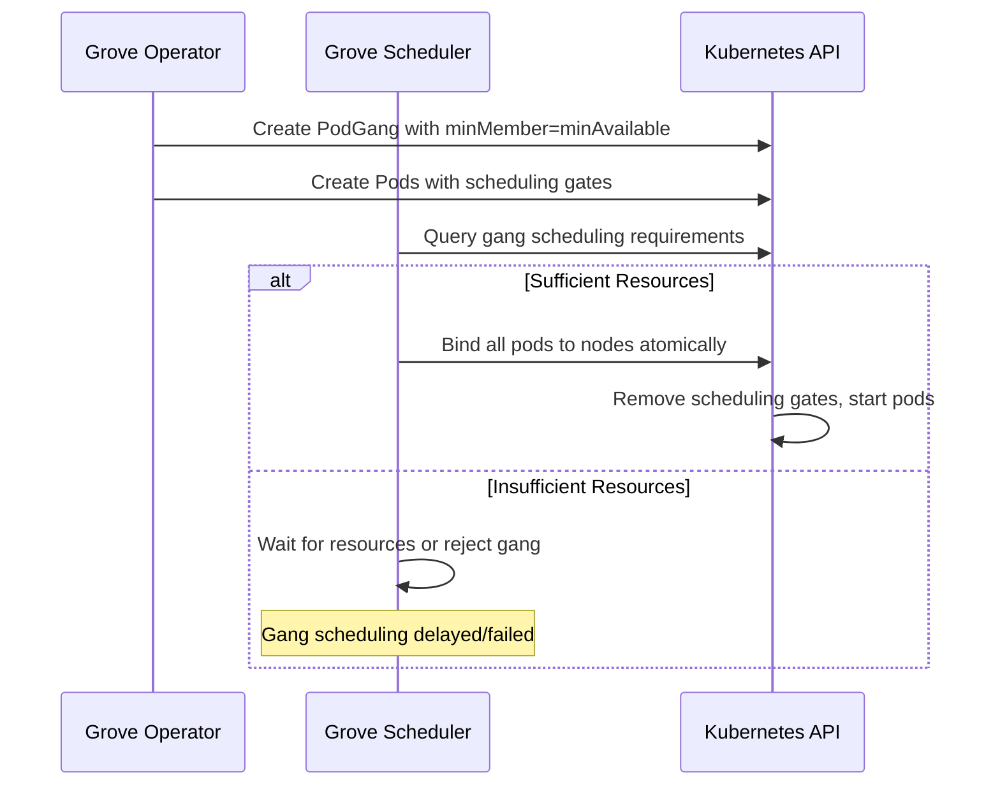
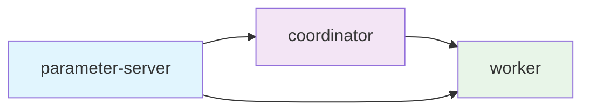
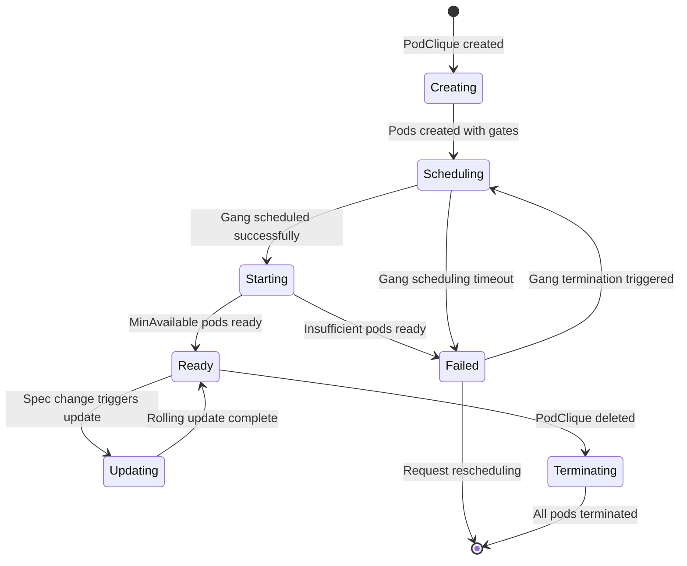

# PodClique

PodClique is a Grove custom resource that represents a group of pods running the same container image and performing the same role within an AI workload. It provides gang scheduling guarantees, startup dependency management, and horizontal pod autoscaling capabilities for homogeneous pod groups.

## Overview

PodClique serves as the fundamental building block for AI workloads in Grove. Each PodClique represents a single role or component within a distributed system, such as worker nodes, parameter servers, or coordinators. All pods within a PodClique run identical container specifications but can be differentiated through environment variables, volume mounts, or init containers.

### Key Capabilities

- **Gang Scheduling**: Ensures pods are scheduled atomically as a group
- **Startup Dependencies**: Declares ordering requirements with other PodCliques
- **Horizontal Pod Autoscaling**: Automatic scaling based on metrics
- **Availability Guarantees**: Maintains minimum number of ready pods
- **Service Discovery**: Automatic headless service creation for pod discovery

### Resources Created by PodClique

For each PodClique, the Grove Operator creates:

| Resource | Purpose | Count |
|----------|---------|-------|
| `Pod` | Actual workload instances | `spec.replicas` |
| `PodGang` | Gang scheduling coordination | 1 (shared with PodCliqueSet) |
| `HorizontalPodAutoscaler` | Automatic scaling | 1 (if `autoScalingConfig` specified) |
| `Service` | Pod discovery | 1 (headless service) |
| `ServiceAccount` | Pod identity and RBAC | 1 |
| `Role` & `RoleBinding` | RBAC permissions | 1 each |

## Specification

A PodClique specification defines the desired state for a group of identical pods:

```yaml
apiVersion: grove.io/v1alpha1
kind: PodClique
metadata:
  name: training-workers
spec:
  roleName: string                    # Role identifier
  podSpec: corev1.PodSpec            # Standard Kubernetes pod spec
  replicas: int32                    # Desired number of pods (minimum 1)
  minAvailable: *int32               # Minimum pods for gang scheduling/availability
  startsAfter: []string              # Startup dependencies on other PodCliques
  autoScalingConfig: *AutoScalingConfig  # HPA configuration
```

### Core Fields

| Field | Type | Required | Default | Description |
|-------|------|----------|---------|-------------|
| `roleName` | `string` | Yes | - | Identifies the role this PodClique serves |
| `podSpec` | `corev1.PodSpec` | Yes | - | Standard Kubernetes pod specification |
| `replicas` | `int32` | Yes | - | Desired number of pod replicas (≥1) |
| `minAvailable` | `*int32` | No | `replicas` | Minimum pods for gang scheduling and availability |
| `startsAfter` | `[]string` | No | `[]` | PodCliques that must start before this one |
| `autoScalingConfig` | `*AutoScalingConfig` | No | `nil` | HPA configuration for automatic scaling |

## Gang Scheduling and MinAvailable

The `minAvailable` field serves dual purposes in Grove's gang scheduling system:

### 1. Gang Scheduling Guarantee
Defines the minimum number of pods that must be schedulable together as an atomic unit. The Grove Scheduler ensures that either all `minAvailable` pods can be scheduled simultaneously, or none are scheduled until sufficient resources become available.

### 2. Availability Threshold  
Sets the minimum number of running pods required for the PodClique to remain operational. If the number of ready pods falls below `minAvailable`, the entire gang may be terminated and rescheduled.

```yaml
spec:
  replicas: 10
  minAvailable: 7    # Gang scheduling: at least 7 pods must be schedulable
                     # Availability: maintain at least 7 ready pods
```

### Gang Scheduling Process



### MinAvailable Examples

```yaml
# Example 1: All pods required (strict gang scheduling)
spec:
  replicas: 4
  minAvailable: 4    # All 4 pods must be scheduled together

# Example 2: Fault-tolerant gang scheduling  
spec:
  replicas: 10
  minAvailable: 7    # Can operate with 7+ pods, but prefer 10

# Example 3: Default behavior
spec:
  replicas: 3
  # minAvailable defaults to 3 (all pods)
```

## Startup Dependencies

PodCliques can specify explicit startup ordering through the `startsAfter` field, which references other PodClique names by their `roleName`. This enables complex initialization sequences where certain components must be ready before others start.

### Dependency Declaration

```yaml
# Parameter Server - starts first (no dependencies)
apiVersion: grove.io/v1alpha1
kind: PodClique
metadata:
  name: parameter-server
spec:
  roleName: parameter-server
  replicas: 2
  # No startsAfter - starts immediately

---
# Coordinator - waits for parameter server
apiVersion: grove.io/v1alpha1  
kind: PodClique
metadata:
  name: coordinator
spec:
  roleName: coordinator
  replicas: 1
  startsAfter: ["parameter-server"]

---  
# Workers - wait for coordinator
apiVersion: grove.io/v1alpha1
kind: PodClique
metadata:
  name: workers
spec:
  roleName: worker
  replicas: 8
  startsAfter: ["coordinator"]
```

### Dependency Graph Validation

Grove validates startup dependencies to prevent cycles:



**Valid**: Linear dependency chain
**Invalid**: Circular dependencies (A → B → C → A)

### Implementation Details

- Dependencies are implemented using the `grove-initc` init container
- Init containers query the Kubernetes API to check dependency readiness
- Pods remain in `Init` phase until all dependencies are satisfied
- The Grove system provides detailed error messages for dependency issues

## Autoscaling Configuration

PodCliques support horizontal pod autoscaling through the `autoScalingConfig` field:

```yaml
spec:
  autoScalingConfig:
    minReplicas: 2                    # Lower bound
    maxReplicas: 20                   # Upper bound  
    metrics:                          # Scaling metrics
    - type: Resource
      resource:
        name: cpu
        target:
          type: Utilization
          averageUtilization: 70
    - type: Resource  
      resource:
        name: memory
        target:
          type: Utilization
          averageUtilization: 80
```

### AutoScalingConfig Fields

| Field | Type | Required | Description |
|-------|------|----------|-------------|
| `minReplicas` | `*int32` | No | Minimum number of replicas (default: current replicas) |
| `maxReplicas` | `int32` | Yes | Maximum number of replicas |
| `metrics` | `[]autoscalingv2.MetricSpec` | Yes | HPA v2 metric specifications |

### Supported Metrics

- **Resource Metrics**: CPU, Memory utilization
- **Custom Metrics**: Application-specific metrics via custom metrics API
- **External Metrics**: Cloud provider or external monitoring system metrics
- **Object Metrics**: Kubernetes object-based metrics (e.g., Ingress QPS)

### Autoscaling with Gang Scheduling

When autoscaling is enabled, HPA changes to `replicas` trigger new gang scheduling decisions:

1. **Scale Up**: New pods are gang scheduled according to `minAvailable` requirements
2. **Scale Down**: Pods are terminated while maintaining `minAvailable` threshold
3. **Availability**: If ready pods < `minAvailable`, the entire gang may be rescheduled

## Status and Lifecycle

PodClique provides comprehensive status reporting for monitoring and debugging:

### Status Fields

| Field | Type | Description |
|-------|------|-------------|
| `replicas` | `int32` | Total number of non-terminated pods |
| `readyReplicas` | `int32` | Number of ready pods |
| `updatedReplicas` | `int32` | Pods at desired revision |
| `scheduledReplicas` | `int32` | Pods scheduled by kube-scheduler |
| `scheduleGatedReplicas` | `int32` | Pods with scheduling gates set |

### Lifecycle Phases  



### Condition Types

PodClique implements standard Kubernetes conditions:

| Condition | Description |
|-----------|-------------|
| `Available` | MinAvailable pods are ready and serving traffic |
| `Progressing` | PodClique is making progress toward desired state |
| `ReplicaFailure` | Failed to create or maintain desired replicas |

## Complete Example

Here's a comprehensive PodClique example for a distributed training worker:

```yaml
apiVersion: grove.io/v1alpha1
kind: PodClique
metadata:
  name: training-workers
  labels:
    app: distributed-training
    component: worker
    version: v1.2.0
spec:
  roleName: worker
  replicas: 8
  minAvailable: 6  # Can operate with 6/8 workers
  
  # Wait for parameter server and coordinator
  startsAfter: ["parameter-server", "coordinator"]
  
  # Standard Kubernetes pod specification
  podSpec:
    containers:
    - name: training-worker
      image: myregistry/training-worker:v1.2.0
      resources:
        requests:
          memory: "16Gi"
          cpu: "8"
          nvidia.com/gpu: "1"
        limits:
          memory: "32Gi"
          cpu: "16"
          nvidia.com/gpu: "1"
      env:
      - name: ROLE
        value: "worker"
      - name: PS_HOSTS
        value: "parameter-server-0.training-ps:2222,parameter-server-1.training-ps:2222"
      - name: WORKER_HOSTS  
        value: "training-workers-0.training-workers:2222,training-workers-1.training-workers:2222"
      ports:
      - containerPort: 2222
        name: training
      - containerPort: 8080
        name: metrics
      volumeMounts:
      - name: model-storage
        mountPath: /mnt/models
      - name: training-data
        mountPath: /mnt/data
      readinessProbe:
        httpGet:
          path: /health
          port: 8080
        initialDelaySeconds: 30
        periodSeconds: 10
      livenessProbe:
        httpGet:
          path: /health
          port: 8080
        initialDelaySeconds: 60
        periodSeconds: 30
    
    volumes:
    - name: model-storage
      persistentVolumeClaim:
        claimName: model-storage-pvc
    - name: training-data
      persistentVolumeClaim:
        claimName: training-data-pvc
    
    # Pod-level scheduling preferences
    nodeSelector:
      nvidia.com/gpu-type: "v100"
    tolerations:
    - key: "training-workload"
      operator: "Equal"
      value: "true"
      effect: "NoSchedule"
    affinity:
      podAntiAffinity:
        preferredDuringSchedulingIgnoredDuringExecution:
        - weight: 100
          podAffinityTerm:
            labelSelector:
              matchLabels:
                grove.io/role: worker
            topologyKey: kubernetes.io/hostname
  
  # Horizontal Pod Autoscaler configuration
  autoScalingConfig:
    minReplicas: 4
    maxReplicas: 16
    metrics:
    - type: Resource
      resource:
        name: cpu
        target:
          type: Utilization
          averageUtilization: 75
    - type: Resource
      resource:
        name: nvidia.com/gpu
        target:
          type: Utilization
          averageUtilization: 85
    - type: Pods
      pods:
        metric:
          name: training_samples_per_second
        target:
          type: AverageValue
          averageValue: "1000"
```

## Generated Resources

This PodClique creates:

### Pods (8 replicas)
- `training-workers-0` through `training-workers-7`
- Each with identical spec but unique network identity
- Init containers for dependency waiting (if `startsAfter` specified)

### HorizontalPodAutoscaler
- Name: `training-workers-hpa`
- Manages scaling based on CPU, GPU, and custom metrics
- Respects `minAvailable` constraints during scaling operations

### Headless Service
- Name: `training-workers-headless`  
- Selector: `grove.io/podclique=training-workers`
- Enables pod discovery via DNS

### RBAC Resources
- ServiceAccount: `training-workers-sa`
- Role: `training-workers-role` (pod management permissions)
- RoleBinding: `training-workers-rolebinding`

## Integration with Grove Components

### PodCliqueSet Integration
PodCliques are typically created by PodCliqueSet resources rather than directly by users. The PodCliqueSet:
- Creates multiple PodClique instances from templates
- Coordinates updates across related PodCliques
- Manages replica distribution and rolling updates

### PodCliqueScalingGroup Integration
Multiple PodCliques can be grouped for coordinated scaling:
- Proportional scaling across related components
- Unified HPA management
- Cross-component availability requirements

### Grove Scheduler Integration
- Creates `PodGang` resources for gang scheduling
- Considers network topology for optimal pod placement
- Implements all-or-nothing scheduling for gang members

### Init Container Integration
- Automatically injects `grove-initc` for dependency management
- Configures volume mounts for API access and pod metadata
- Handles graceful startup coordination

## Best Practices

### Resource Planning
1. **Size Appropriately**: Balance `replicas` vs `minAvailable` for fault tolerance
2. **Resource Requests**: Set accurate CPU/memory requests for scheduling
3. **Node Selection**: Use nodeSelector/affinity for hardware requirements

### Gang Scheduling
1. **Conservative MinAvailable**: Start with high values, tune based on experience  
2. **Cluster Capacity**: Ensure cluster can satisfy gang requirements
3. **Priority Classes**: Use priority classes for important workloads

### Dependencies
1. **Minimize Dependencies**: Keep dependency graphs simple
2. **Health Checks**: Ensure dependency readiness probes are reliable
3. **Timeout Handling**: Plan for dependency startup failures

### Autoscaling
1. **Metric Selection**: Choose metrics that reflect actual workload
2. **Scaling Bounds**: Set realistic min/max replica limits
3. **Stability**: Avoid aggressive scaling policies that cause thrashing

## Troubleshooting

### Common Issues

#### Pods Stuck in Pending
```bash
# Check gang scheduling status
kubectl describe podgang <podgang-name>

# Check node resource availability  
kubectl describe nodes

# Check for scheduling constraints
kubectl get events --field-selector involvedObject.kind=Pod
```

#### Startup Dependencies Not Working
```bash
# Check init container logs
kubectl logs <pod-name> -c grove-initc

# Verify dependency PodClique status
kubectl get podclique <dependency-name> -o yaml

# Check RBAC permissions for init container
kubectl auth can-i get podcliques --as=system:serviceaccount:<namespace>:<sa-name>
```

#### Autoscaling Issues
```bash
# Check HPA status
kubectl get hpa <podclique-name>-hpa -o yaml

# Check metric availability
kubectl top pods -l grove.io/podclique=<podclique-name>

# Check scaling events
kubectl get events --field-selector involvedObject.kind=HorizontalPodAutoscaler
```

### Debug Commands

```bash
# Get PodClique status
kubectl get podclique <name> -o yaml

# Check all related resources
kubectl get pods,svc,hpa -l grove.io/podclique=<name>

# Monitor PodClique changes
kubectl get podclique <name> -w

# Check pod readiness and scheduling
kubectl get pods -l grove.io/podclique=<name> -o wide

# Describe specific pod issues
kubectl describe pod <pod-name>
```
