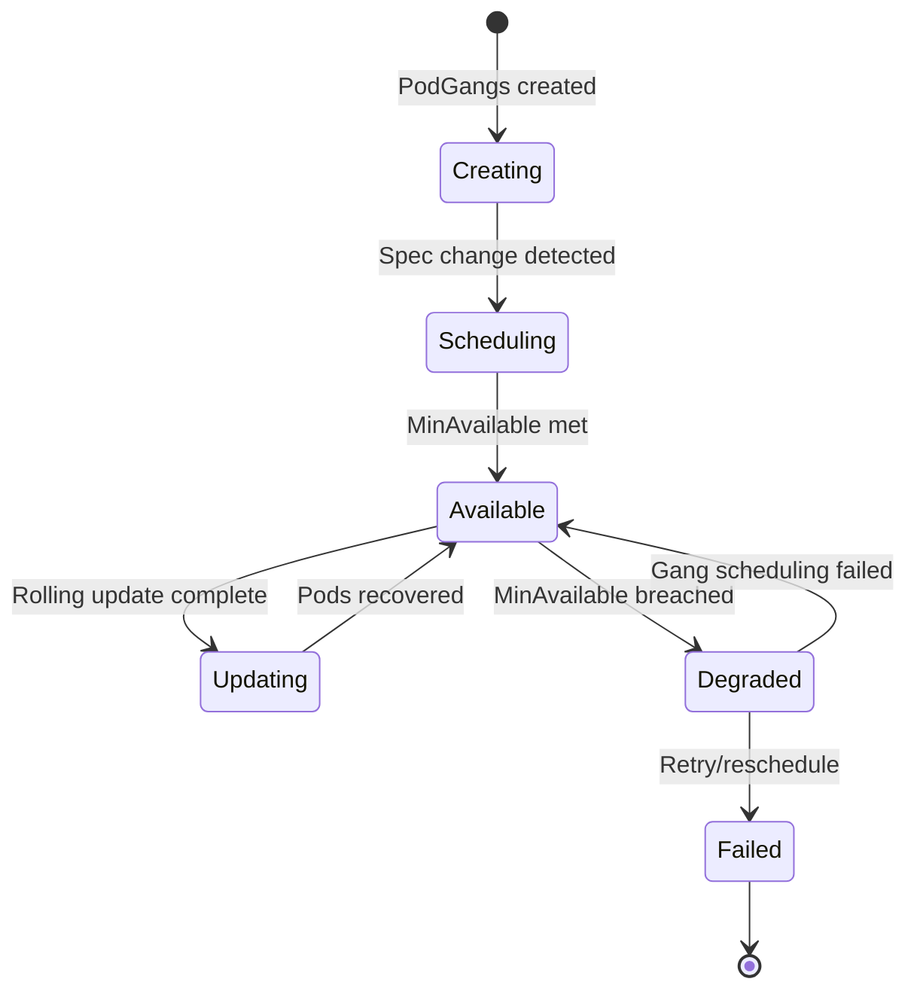

# PodCliqueSet

PodCliqueSet is the top-level Grove custom resource that defines AI workload topologies and their scaling behavior. It serves as the primary interface for users to declare multi-component AI workloads that require coordinated scheduling, dependency management, and scaling across multiple pods.

## Overview

PodCliqueSet operates as the root resource in Grove's hierarchical model, creating and managing child resources to implement complex AI workload patterns. It abstracts the complexity of multi-pod AI applications into a declarative specification that the Grove Operator can execute.

### What PodCliqueSet Creates

For each PodCliqueSet, the Grove Operator automatically creates:

| Resource Type | Naming Pattern | Purpose |
|---------------|----------------|---------|
| `PodGang` | `{podcliqueset-name}-{replica-index}` | Gang scheduling unit |
| `PodClique` | `{podcliqueset-name}-{clique-name}-{replica-index}` | Component management |
| `PodCliqueScalingGroup` | `{podcliqueset-name}-{group-name}` | Coordinated scaling |
| `Service` | `{podcliqueset-name}-headless` | Pod discovery (if enabled) |
| `HorizontalPodAutoscaler` | Per PodClique/ScalingGroup | Automatic scaling |

## Resource Specification

### PodCliqueSetSpec Structure

```yaml
apiVersion: grove.io/v1alpha1
kind: PodCliqueSet
spec:
  replicas: int32                                    # Number of PodGang replicas
  template: PodCliqueSetTemplateSpec                 # Template for PodGangs  
  replicaSpreadConstraints: []TopologySpreadConstraint  # Replica placement rules
```

| Field | Type | Required | Description |
|-------|------|----------|-------------|
| `replicas` | `int32` | Yes | Number of PodGang replicas to create |
| `template` | `PodCliqueSetTemplateSpec` | Yes | Template for PodGangs and their constituent PodCliques |
| `replicaSpreadConstraints` | `[]TopologySpreadConstraint` | No | Topology spread constraints for replicas |

### Template Specification

The `PodCliqueSetTemplateSpec` contains the blueprint for creating PodGangs:

```yaml
template:
  cliques: []PodCliqueTemplateSpec           # Individual workload components
  cliqueStartupType: CliqueStartupType       # Startup dependency behavior
  schedulingPolicyConfig: SchedulingPolicyConfig  # Network topology awareness
  podCliqueScalingGroups: []PodCliqueScalingGroupConfig  # Coordinated scaling groups
```

#### Clique Definitions

Each `PodCliqueTemplateSpec` defines a component role within the AI workload:

```yaml
cliques:
- name: "worker"                    # Unique role identifier
  labels:                          # Resource labeling
    component: "training-worker"
  annotations:                     # Resource metadata
    description: "Training workers"
  spec:                           # PodClique specification
    roleName: "worker"            # Component role name
    podSpec: {}                   # Standard Kubernetes pod spec
    replicas: 4                   # Instance count
    minAvailable: 3               # Gang scheduling threshold
    startsAfter: ["coordinator"]  # Startup dependencies
    autoScalingConfig:            # HPA configuration
      minReplicas: 2
      maxReplicas: 10
      metrics: []
```

#### Startup Control

The `cliqueStartupType` field controls initialization ordering:

| Value | Description | Use Case |
|-------|-------------|----------|
| `CliqueStartupTypeAnyOrder` | Concurrent startup (default) | Independent components |
| `CliqueStartupTypeInOrder` | Sequential by cliques array order | Simple linear dependencies |
| `CliqueStartupTypeExplicit` | Dependency-driven via `startsAfter` | Complex dependency graphs |

#### Network Topology Configuration

`SchedulingPolicyConfig` enables network-aware scheduling:

```yaml
schedulingPolicyConfig:
  networkPackGroupConfigs:
  - cliqueNames: ["trainer", "workers"]    # Co-locate these cliques
    # Scheduler places these on high-bandwidth nodes
```

#### Scaling Group Configuration

`PodCliqueScalingGroupConfig` enables coordinated scaling:

```yaml
podCliqueScalingGroups:
- name: "training-workers"
  cliqueNames: ["worker", "parameter-server"]  # Scale together
  replicas: 3                                  # Base multiplier
  minAvailable: 2                             # Availability threshold
  scaleConfig:                                # HPA configuration
    minReplicas: 1
    maxReplicas: 10
    metrics:
    - type: Resource
      resource:
        name: cpu
        target:
          type: Utilization
          averageUtilization: 80
```

## Status and Lifecycle Management

### PodCliqueSetStatus Fields

The operator maintains comprehensive status through `PodCliqueSetStatus`:

| Field | Purpose |
|-------|---------|
| `replicas` | Total PodGang replicas created |
| `updatedReplicas` | Replicas at current revision |
| `availableReplicas` | Replicas meeting availability requirements |
| `currentGenerationHash` | Hash of current specification |
| `podGangStatuses` | Status of individual PodGangs |
| `rollingUpdateProgress` | Rolling update state |

### Replica Availability Logic

A PodCliqueSet replica is considered available when:

1. All standalone PodCliques have `MinAvailableBreached` condition = `False`
2. All PodCliqueScalingGroups have `MinAvailableBreached` condition = `False`

### Lifecycle States



## Rolling Update Management

PodCliqueSet supports sophisticated rolling updates through `PodCliqueSetRollingUpdateProgress`.

### Update Process

1. **Hash Computation**: Generate new generation hash from spec changes
2. **Scaling Group Updates**: Update PodCliqueScalingGroup specs first
3. **Standalone Updates**: Update individual PodClique specs  
4. **Replica Selection**: Select ready replicas for update one at a time
5. **Pod Replacement**: Replace pods in selected replica
6. **Progress Tracking**: Update progress status and move to next replica

### Progress Tracking

The `PodCliqueSetRollingUpdateProgress` tracks:

```yaml
rollingUpdateProgress:
  updateStartedAt: "2023-09-21T10:00:00Z"     # Start timestamp
  updateEndedAt: "2023-09-21T10:05:30Z"       # End timestamp (when complete)
  updatedPodCliqueScalingGroups: ["workers"]  # Completed scaling groups
  updatedPodCliques: ["coordinator"]          # Completed standalone cliques
  currentlyUpdating:                          # Active update details
    podCliqueScalingGroupName: "workers"
    podCliqueName: "worker"
    replicaIndex: 1
```

## Complete Example

Here's a comprehensive PodCliqueSet example for distributed training:

```yaml
apiVersion: grove.io/v1alpha1
kind: PodCliqueSet
metadata:
  name: distributed-training
  labels:
    app: ml-training
    version: v1.0.0
spec:
  replicas: 2  # Two complete training environments
  
  replicaSpreadConstraints:
  - maxSkew: 1
    topologyKey: kubernetes.io/zone
    whenUnsatisfiable: ScheduleAnyway
  
  template:
    # Startup ordering: parameter-server -> coordinator -> worker
    cliqueStartupType: CliqueStartupTypeExplicit
    
    # Network-aware scheduling
    schedulingPolicyConfig:
      networkPackGroups:
      - cliqueNames: ["worker", "parameter-server"]
        # Co-locate workers and PS on high-bandwidth nodes
    
    # Individual component definitions
    cliques:
    - name: parameter-server
      labels:
        component: parameter-server
      spec:
        roleName: parameter-server
        replicas: 1
        minAvailable: 1
        podSpec:
          containers:
          - name: ps
            image: tensorflow/tensorflow:2.8.0
            resources:
              requests:
                memory: "4Gi"
                cpu: "2"
              limits:
                memory: "8Gi"
                cpu: "4"
        autoScalingConfig:
          minReplicas: 1
          maxReplicas: 3
          metrics:
          - type: Resource
            resource:
              name: cpu
              target:
                type: Utilization
                averageUtilization: 70
    
    - name: coordinator
      labels:
        component: coordinator
      spec:
        roleName: coordinator
        replicas: 1
        minAvailable: 1
        startsAfter: ["parameter-server"]  # Wait for PS
        podSpec:
          containers:
          - name: coordinator
            image: training/coordinator:v1.0
            resources:
              requests:
                memory: "2Gi"
                cpu: "1"
    
    - name: worker
      labels:
        component: worker
      spec:
        roleName: worker
        replicas: 4
        minAvailable: 3  # Can function with 3/4 workers
        startsAfter: ["coordinator"]  # Wait for coordinator
        podSpec:
          containers:
          - name: worker
            image: training/worker:v1.0
            resources:
              requests:
                memory: "8Gi"
                cpu: "4"
                nvidia.com/gpu: "1"
              limits:
                memory: "16Gi"
                cpu: "8"
                nvidia.com/gpu: "1"
    
    # Coordinated scaling configuration
    podCliqueScalingGroups:
    - name: training-infrastructure
      cliqueNames: ["worker", "parameter-server"]
      replicas: 2  # Scale workers and PS together
      minAvailable: 1
      scaleConfig:
        minReplicas: 1
        maxReplicas: 5
        metrics:
        - type: Resource
          resource:
            name: cpu
            target:
              type: Utilization
              averageUtilization: 80
```

## Generated Resources

This PodCliqueSet creates the following resources:

### PodGangs (2 replicas)
- `distributed-training-0`
- `distributed-training-1`

### PodCliques (6 total)
- `distributed-training-parameter-server-0`
- `distributed-training-parameter-server-1` 
- `distributed-training-coordinator-0`
- `distributed-training-coordinator-1`
- `distributed-training-worker-0`
- `distributed-training-worker-1`

### PodCliqueScalingGroup (1)
- `distributed-training-training-infrastructure`

### Additional Resources
- Headless Service: `distributed-training-headless`
- HPAs for each PodClique and the scaling group
- ServiceAccounts, Roles, and RoleBindings for RBAC

## Label Selectors

Grove applies consistent labeling for resource correlation:

```yaml
grove.io/podcliqueset: distributed-training
grove.io/podgang: distributed-training-0
grove.io/podclique: distributed-training-worker-0  
grove.io/role: worker
```

## Integration Points

### Operator Controller Integration

The PodCliqueSet controller:
1. Watches PodCliqueSet resources for changes
2. Computes generation hashes for rolling update detection
3. Creates and manages child resources
4. Reconciles status from child resource conditions
5. Manages rolling update progression

### Scheduler Integration

PodCliqueSet drives Grove Scheduler behavior through:
- `PodGang` creation for gang scheduling coordination
- `NetworkPackGroupConfig` for topology-aware placement
- `MinAvailable` thresholds for gang termination logic

## Best Practices

1. **Plan Dependencies Carefully**: Use `cliqueStartupType: CliqueStartupTypeExplicit` for complex startup sequences
2. **Set Realistic MinAvailable**: Balance availability requirements with resource efficiency
3. **Use Scaling Groups**: Group related cliques that should scale proportionally
4. **Configure Network Topology**: Leverage network-aware scheduling for performance-critical workloads
5. **Monitor Rolling Updates**: Watch `rollingUpdateProgress` during deployments
6. **Resource Planning**: Consider total resource requirements across all replicas

## Troubleshooting

### Common Issues

1. **Pods Stuck Pending**: Check gang scheduling requirements and cluster capacity
2. **Rolling Update Stuck**: Verify `minAvailable` settings allow updates to proceed
3. **Startup Dependencies**: Ensure `startsAfter` references valid clique names
4. **Scaling Issues**: Check HPA metrics and resource availability

### Debugging Commands

```bash
# Check PodCliqueSet status
kubectl get podcliqueset distributed-training -o yaml

# Check generated resources
kubectl get podclique,podgang,svc -l grove.io/podcliqueset=distributed-training

# Monitor rolling updates
kubectl get podcliqueset distributed-training -w

# Check individual PodClique status
kubectl describe podclique distributed-training-worker-0
```
