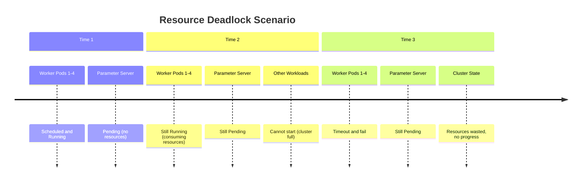
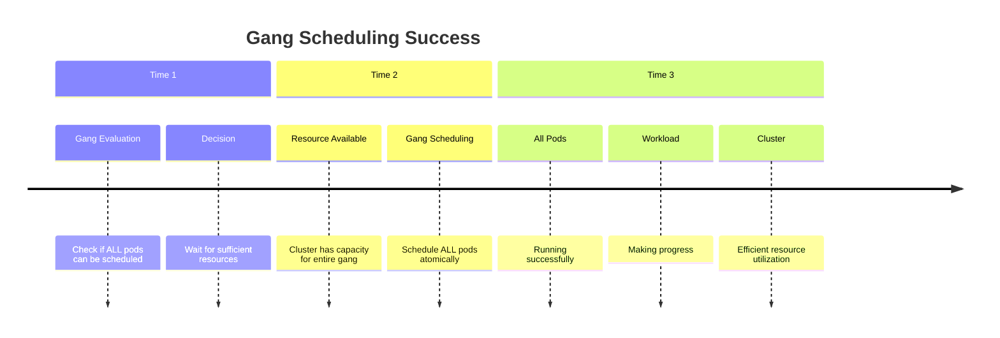
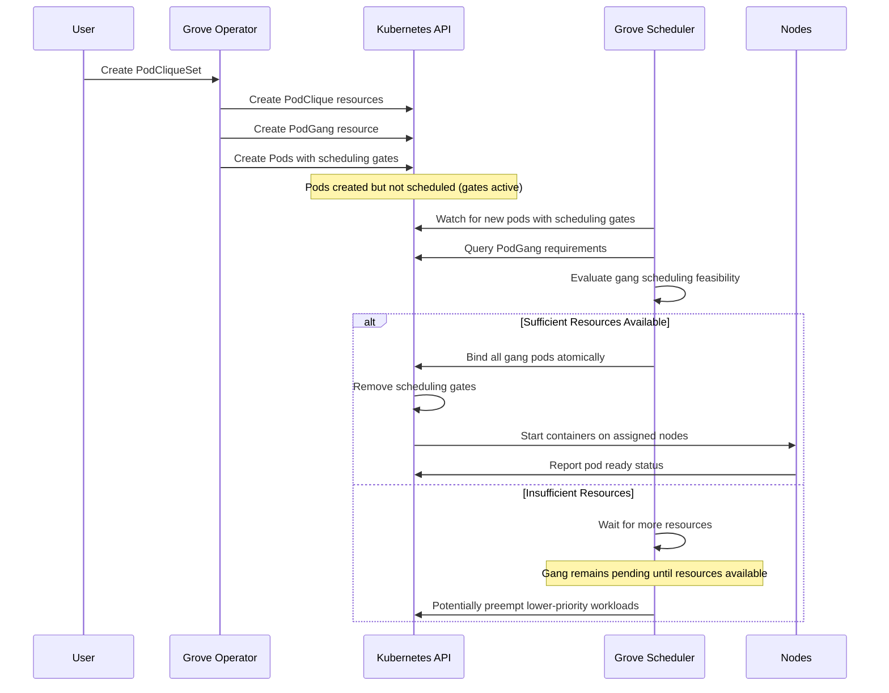
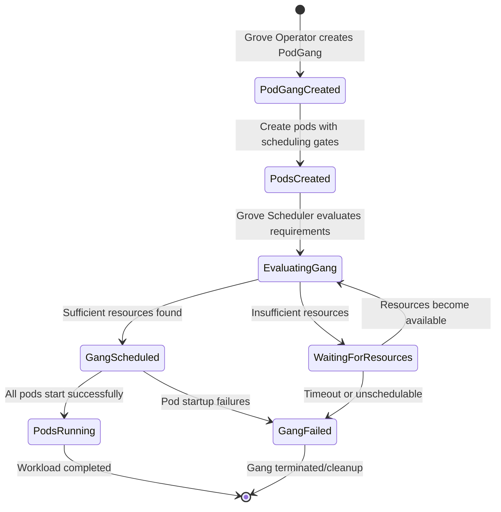
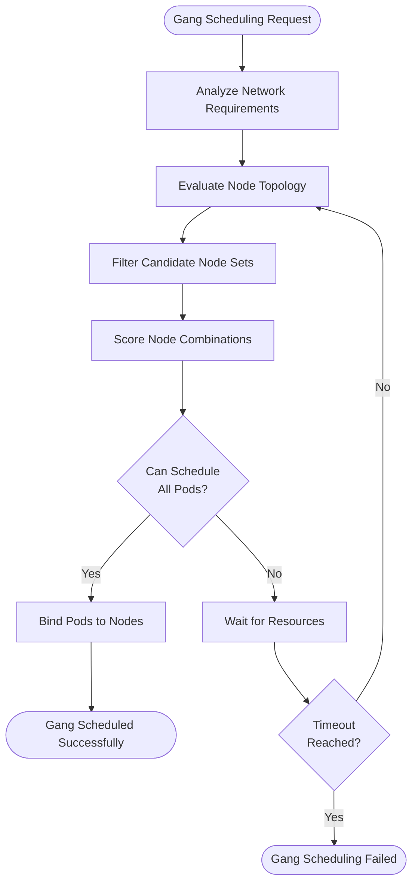
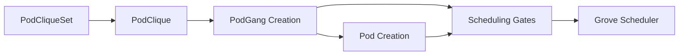
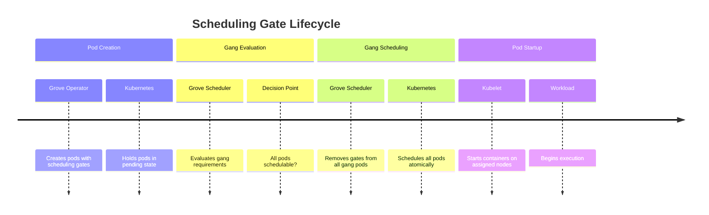

# PodGang and Gang Scheduling

This document covers Grove's gang scheduling capabilities through the `PodGang` custom resource and the network topology-aware scheduling implementation. Gang scheduling ensures that groups of pods are scheduled atomically - either all pods in a gang are successfully placed on nodes, or none are scheduled until sufficient resources become available.

## Overview

Gang scheduling addresses a critical challenge in distributed AI workloads where multiple pods must be co-located or scheduled together to function properly. Without gang scheduling, partial scheduling can lead to resource deadlocks where some pods are running while others remain pending, consuming cluster resources without providing value.

### The Problem Gang Scheduling Solves

**Without Gang Scheduling:**


**With Gang Scheduling:**


### Key Benefits

| Benefit | Description |
|---------|-------------|
| **Resource Efficiency** | Prevents partial allocations that waste cluster resources |
| **Deadlock Prevention** | Avoids scenarios where workloads are partially scheduled indefinitely |
| **Network Optimization** | Places communicating pods optimally based on network topology |
| **Atomic Operations** | Ensures all-or-nothing scheduling for interdependent pod groups |
| **Scalability** | Supports coordinated scaling of multi-component AI systems |

## PodGang Resource Structure

Grove implements gang scheduling through the `PodGang` custom resource in the `scheduler.grove.io/v1alpha1` API group. PodGang resources are automatically created by the Grove Operator and consumed by the Grove Scheduler.

### API Structure

```yaml
apiVersion: scheduler.grove.io/v1alpha1
kind: PodGang
metadata:
  name: distributed-training-0
  namespace: default
spec:
  podgroups: []PodGroup                          # Groups of pods to be scheduled together
  networkPackGroupConfigs: []NetworkPackGroupConfig # Network pack group configurations
  spreadConstraints: []TopologySpreadConstraint     # Topology spread constraints (optional)
  priorityClassName: string                          # Priority class name (optional)
```

### PodGroup Structure

Each `PodGroup` defines a specific group of pods within the gang:

```yaml
podgroups:
- name: "worker"                    # Group identifier  
  podReferences: []NamespacedName   # References to actual Pod resources
  minReplicas: 4                    # Minimum pods that need gang scheduling
```

### Field Descriptions

| Field | Type | Required | Description |
|-------|------|----------|-------------|
| `podgroups` | `[]PodGroup` | Yes | Defines the groups of pods that must be scheduled together |
| `networkPackGroupConfigs` | `[]NetworkPackGroupConfig` | No | Network pack group configurations |
| `spreadConstraints` | `[]TopologySpreadConstraint` | No | Topology spread constraints |
| `priorityClassName` | `string` | No | Priority class name for scheduling |

## Gang Scheduling Lifecycle

The gang scheduling process involves coordination between Grove Operator, Grove Scheduler, and Kubernetes API server.

### Complete Scheduling Flow



### Scheduling States



## Network Topology-Aware Scheduling

Grove's scheduler extends gang scheduling with network topology awareness, optimizing pod placement based on network proximity and bandwidth characteristics.

### Network Topology Configuration

```yaml
# In PodCliqueSet specification
schedulingPolicyConfig:
  networkPackGroups:
  - cliqueNames: ["trainer", "workers"]     # PodCliques to co-locate
    # Scheduler places these on high-bandwidth interconnected nodes
  - cliqueNames: ["parameter-server"]
    # Different network requirements - can be placed separately
```

### Scheduling Decision Process



### Network Topology Factors

The Grove Scheduler considers multiple factors when making network-aware gang scheduling decisions:

| Factor | Weight | Impact |
|--------|--------|---------|
| **Network Bandwidth** | High | Inter-node communication speed |
| **Node Proximity** | Medium | Communication latency |
| **Resource Availability** | High | Ability to satisfy gang requirements |
| **Failure Domain Distribution** | Medium | Resilience to node failures |

### Example Network Pack Groups

```yaml
# High-bandwidth training workload
apiVersion: grove.io/v1alpha1
kind: PodCliqueSet
spec:
  template:
    schedulingPolicyConfig:
      networkPackGroups:
      # Group 1: Training components that need high bandwidth
      - cliqueNames: ["worker", "parameter-server"]
        networkTopology:
          nodeLabelSelector:
            matchLabels:
              node.grove.io/network-tier: "high-bandwidth"
              node.grove.io/interconnect: "infiniband"
      
      # Group 2: Coordination components with different requirements  
      - cliqueNames: ["coordinator", "monitor"]
        networkTopology:
          nodeLabelSelector:
            matchLabels:
              node.grove.io/network-tier: "standard"
```

## PodGang Creation and Management

PodGang resources are automatically created and managed by the Grove Operator - users typically don't interact with them directly.

### Operator-Managed Creation



### PodGang Naming Convention

```yaml
# Pattern: {podcliqueset-name}-{replica-index}
metadata:
  name: distributed-training-0    # First replica
  name: distributed-training-1    # Second replica
  labels:
    grove.io/podcliqueset: distributed-training
    grove.io/podgang-replica: "0"
```

### Generated PodGang Example

Based on a PodCliqueSet with multiple cliques, the operator creates:

```yaml
apiVersion: scheduler.grove.io/v1alpha1
kind: PodGang
metadata:
  name: distributed-training-0
  namespace: ml-training
  labels:
    grove.io/podcliqueset: distributed-training
    grove.io/podgang-replica: "0"
spec:
  podgroups:
  - name: worker
    minReplicas: 3  # Need at least 3 workers for gang scheduling
    podReferences:
    - namespace: ml-training
      name: distributed-training-worker-0-0
    - namespace: ml-training
      name: distributed-training-worker-0-1
    - namespace: ml-training
      name: distributed-training-worker-0-2
    - namespace: ml-training
      name: distributed-training-worker-0-3
  
  - name: parameter-server
    minReplicas: 1  # Need at least 1 PS
    podReferences:
    - namespace: ml-training
      name: distributed-training-parameter-server-0-0
    - namespace: ml-training
      name: distributed-training-parameter-server-0-1
  
  - name: coordinator
    minReplicas: 1  # Need coordinator
    podReferences:
    - namespace: ml-training
      name: distributed-training-coordinator-0-0
  
  networkPackGroupConfigs:
  - podGroupNames: ["worker", "parameter-server"]
  
  priorityClassName: high-priority
```

## Scheduling Gates and Pod Coordination

Grove uses Kubernetes scheduling gates to prevent pods from being scheduled until gang requirements are met.

### Scheduling Gate Mechanism

```yaml
# Pod created with scheduling gate
apiVersion: v1
kind: Pod
spec:
  schedulingGates:
  - name: grove.io/gang-scheduling
  containers: [...] 

# Gate removed when gang can be scheduled
spec:
  schedulingGates: []  # Empty - pod can be scheduled
```

### Gate Lifecycle



## Integration with Grove Components

### Grove Operator Integration

The Grove Operator:
- **Creates PodGang resources** based on PodClique specifications
- **Sets scheduling gates** on individual pods
- **Manages labels and selectors** for gang coordination
- **Handles cleanup** when gangs are terminated

### Grove Scheduler Integration

The Grove Scheduler:
- **Watches PodGang resources** for scheduling requirements
- **Implements gang scheduling logic** for atomic pod placement
- **Considers network topology** for optimal placement
- **Manages scheduling gate removal** when gangs can be scheduled

### Kubernetes Integration

Grove integrates with standard Kubernetes components:
- **Scheduler Framework**: Uses plugin architecture for gang scheduling
- **API Server**: Stores PodGang resources and scheduling state
- **Kubelet**: Starts pods after gang scheduling decisions
- **Resource Quotas**: Respects namespace resource limits for gangs

## Gang Scheduling Strategies

### All-or-Nothing Strategy

```yaml
spec:
  minMember: 3  # All pod groups must be schedulable
  podGroups:
  - name: worker
    replicas: 4
  - name: parameter-server  
    replicas: 2
  - name: coordinator
    replicas: 1
```

**Behavior**: Gang only schedules if ALL 7 pods (4+2+1) can be placed

### Partial Gang Strategy

```yaml
spec:
  minMember: 2  # Only need 2 out of 3 pod groups
  podGroups:
  - name: worker
    replicas: 4      # Essential
  - name: parameter-server
    replicas: 2      # Essential  
  - name: monitor
    replicas: 1      # Optional
```

**Behavior**: Gang schedules if worker + parameter-server pods can be placed (monitor optional)

### Minimum Viable Strategy

```yaml  
spec:
  minMember: 1  # Only need core functionality
  podGroups:
  - name: all-in-one
    replicas: 1      # Single pod with all functionality
  - name: worker
    replicas: 3      # Additional workers (optional)
```

**Behavior**: Gang schedules with just the all-in-one pod, workers added if possible

## Troubleshooting Gang Scheduling

### Common Issues

#### Gang Stuck in Pending

**Symptoms:**
- Pods remain in `Pending` state with scheduling gates
- PodGang shows insufficient resources

**Diagnosis:**
```bash
# Check PodGang status
kubectl get podgang <podgang-name> -o yaml

# Check cluster resource availability
kubectl describe nodes | grep -A 5 "Allocated resources"

# Check for resource constraints
kubectl get events --field-selector reason=FailedScheduling
```

**Solutions:**
- Increase cluster capacity
- Reduce pod resource requests  
- Adjust `minMember` requirements
- Check node selectors and affinity rules

#### Network Topology Constraints

**Symptoms:**
- Gang scheduling fails despite sufficient total resources
- Pods scheduled on nodes without required network connectivity

**Diagnosis:**
```bash
# Check network topology labels
kubectl get nodes --show-labels | grep network

# Check PodGang network requirements
kubectl get podgang <name> -o jsonpath='{.spec.networkTopology}'

# Check scheduler logs
kubectl logs -n grove-system grove-scheduler-xxx
```

**Solutions:**
- Verify node network topology labels
- Adjust network pack group requirements
- Add more nodes with required network characteristics

#### Gang Scheduling Timeout

**Symptoms:**
- Gang eventually fails after waiting period
- Resources become available but gang doesn't schedule

**Diagnosis:**
```bash  
# Check gang scheduling timeout configuration
kubectl get configmap grove-scheduler-config -o yaml

# Check for scheduling conflicts
kubectl get events --sort-by='.lastTimestamp'

# Check priority class configuration
kubectl get priorityclass
```

**Solutions:**
- Increase gang scheduling timeout
- Adjust priority classes for better preemption
- Reduce competition from other workloads

### Debug Commands

```bash
# Get all gang-related resources
kubectl get podgang,podclique,pods -l grove.io/podcliqueset=<name>

# Check gang scheduling status
kubectl describe podgang <podgang-name>

# Monitor gang scheduling in real-time
kubectl get podgang <podgang-name> -w

# Check pod scheduling gates
kubectl get pods -o custom-columns="NAME:.metadata.name,GATES:.spec.schedulingGates[*].name"

# Check scheduler decision logs
kubectl logs -n grove-system -l component=grove-scheduler --tail=100

# Verify network topology
kubectl get nodes -o custom-columns="NAME:.metadata.name,NETWORK:.metadata.labels.node\.grove\.io/network-tier"
```

## Performance Considerations

### Scaling Characteristics

| Gang Size | Scheduling Latency | Resource Overhead | Complexity |
|-----------|-------------------|-------------------|------------|
| 1-10 pods | Low (< 1s) | Minimal | Simple |
| 11-50 pods | Medium (1-5s) | Low | Moderate |
| 51-100 pods | High (5-15s) | Medium | Complex |
| 100+ pods | Very High (15s+) | High | Very Complex |

### Optimization Tips

1. **Right-size Gangs**: Use minimum viable gang sizes
2. **Network Planning**: Pre-label nodes for network topology
3. **Resource Buffers**: Maintain cluster capacity buffers for gang scheduling
4. **Priority Classes**: Use priority classes for important gangs
5. **Monitoring**: Set up comprehensive gang scheduling metrics

## Best Practices

### Gang Design

1. **Minimize Gang Size**: Only include pods that truly need coordinated scheduling
2. **Set Appropriate MinMember**: Balance availability with resource efficiency  
3. **Plan for Failures**: Design gangs to handle individual pod failures
4. **Consider Resource Requirements**: Ensure cluster can satisfy gang requirements

### Cluster Configuration

1. **Node Labeling**: Properly label nodes for network topology awareness
2. **Resource Planning**: Maintain sufficient capacity for largest expected gangs
3. **Priority Classes**: Configure priority classes for gang preemption
4. **Monitoring**: Implement gang scheduling observability

### Operational Guidelines

1. **Testing**: Test gang scheduling with realistic cluster loads
2. **Gradual Rollout**: Start with smaller gangs and scale up
3. **Resource Monitoring**: Monitor cluster utilization patterns
4. **Documentation**: Document gang requirements and dependencies
